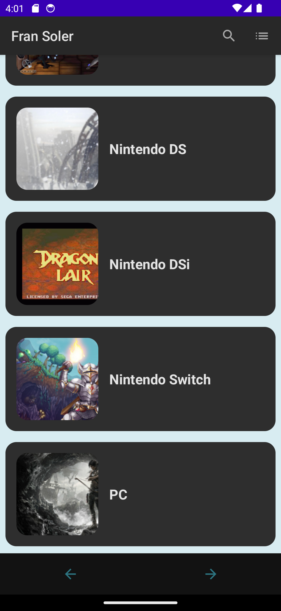
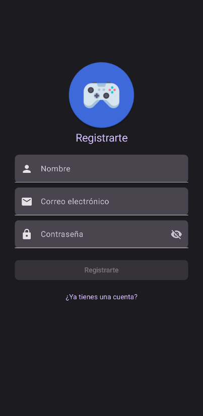
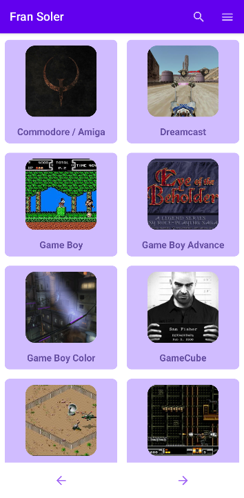
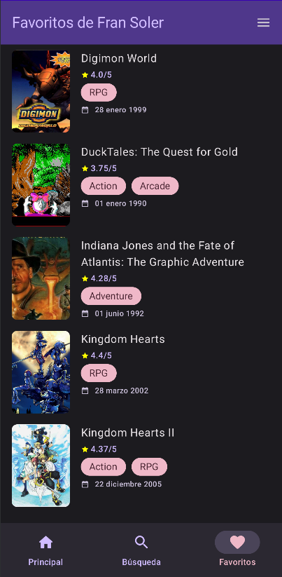
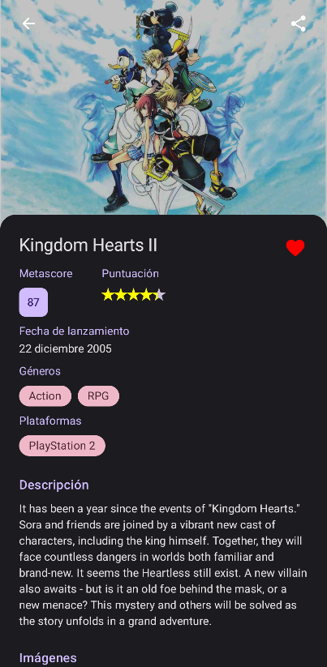
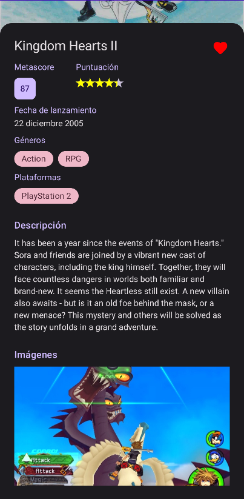

# GameNexus

**GameNexus** es una aplicación Android desarrollada en Kotlin que permite a los usuarios explorar y descubrir videojuegos utilizando la API de RAWG, un popular sitio web de información sobre videojuegos.

## Tecnologías Clave

- **Kotlin**: El lenguaje de programación principal empleado para el desarrollo de la aplicación. Kotlin es conocido por su concisión y seguridad, lo que lo convierte en una elección sólida para el desarrollo de aplicaciones Android.
  
- **Jetpack Compose**: Esta tecnología permite la creación de interfaces de usuario modernas y dinámicas utilizando un enfoque declarativo, lo que facilita la creación y mantenimiento de la interfaz de usuario.
  
- **Retrofit**: La biblioteca Retrofit se utiliza para realizar solicitudes HTTP eficientes a la API de RAWG. Facilita la comunicación con la API y el manejo de datos JSON de manera sencilla.
  
- **Room**: La aplicación GameNexus utiliza la biblioteca Room para la gestión eficiente de la base de datos local, simplificando la interacción con SQLite en Android.
  
- **Firebase**: Autenticación y registro seguros de nuevos usuarios en la aplicación.
  
- **API de RAWG**: Proporciona información sobre videojuegos, incluyendo detalles del juego, reseñas, clasificaciones y más.
  
- **Arquitectura MVVM**: Sigue el patrón de arquitectura MVVM (Model-View-ViewModel) para separar la lógica de la interfaz de usuario de la lógica de negocio y los datos. Esto mejora la modularidad y la facilidad de prueba del código.

## Funcionalidades

- **Búsqueda avanzada**: GameNexus permite a los usuarios buscar videojuegos por género, plataforma, fecha de lanzamiento y otros criterios a través de consultas avanzadas a la API de RAWG.

- - **Detalle de juegos**: Los usuarios pueden acceder a información detallada sobre cada videojuego, incluyendo descripciones, reseñas, clasificaciones y capturas de pantalla.
  
- **Gestión de favoritos**: Los usuarios pueden agregar juegos a su lista de favoritos para un acceso rápido a títulos de interés.
  
- **Autenticación de usuarios**: El sistema de autenticación, apoyado por Firebase, permite a los usuarios registrarse, iniciar sesión de forma segura y gestionar su cuenta.

## Instalación

Para ejecutar el proyecto localmente, sigue estos pasos:

1. **Clona el repositorio**:
```bash
git clone https://github.com/fransolerc/GameNexus.git
```

2. Abre el proyecto en Android Studio.

3. Configura Firebase: Agrega tu archivo `google-services.json` al directorio `/app`.

4. Obtén la clave de API de RAWG:

- Regístrate en RAWG y genera una clave de API.
- Añade la clave en tu archivo `local.properties`:
```bash
API_KEY_RAWG="TU_CLAVE_DE_API"
```
5. Ejecuta la aplicación desde Android Studio en un emulador o dispositivo físico.

<p>
  
</p>
<p>
  
</p>
<p>
  
</p>
<p>
  
</p>
<p>
  
</p>
<p>
  
</p>
<p>
  
</p>







